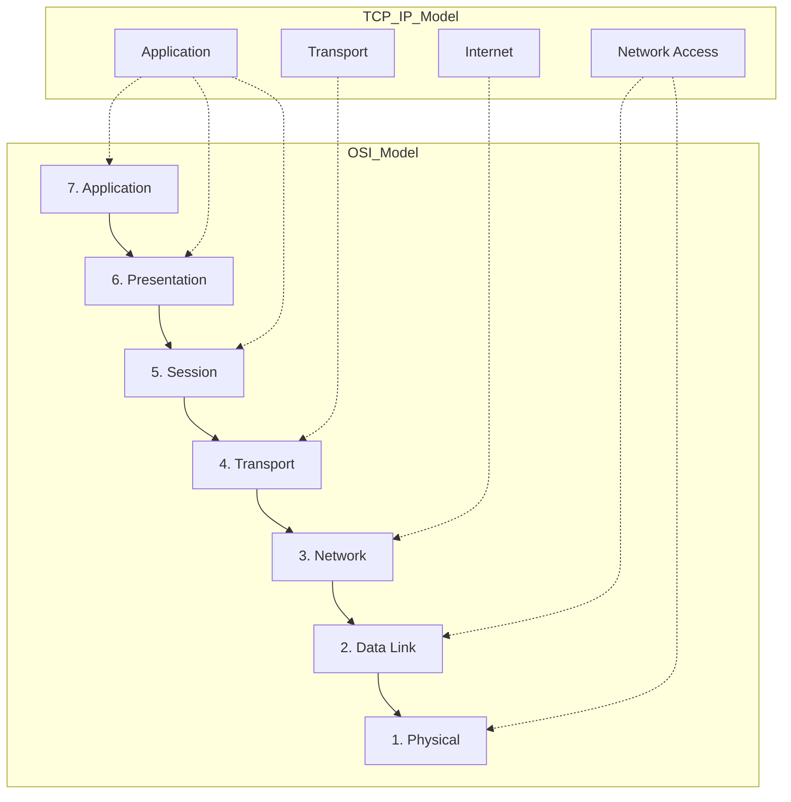
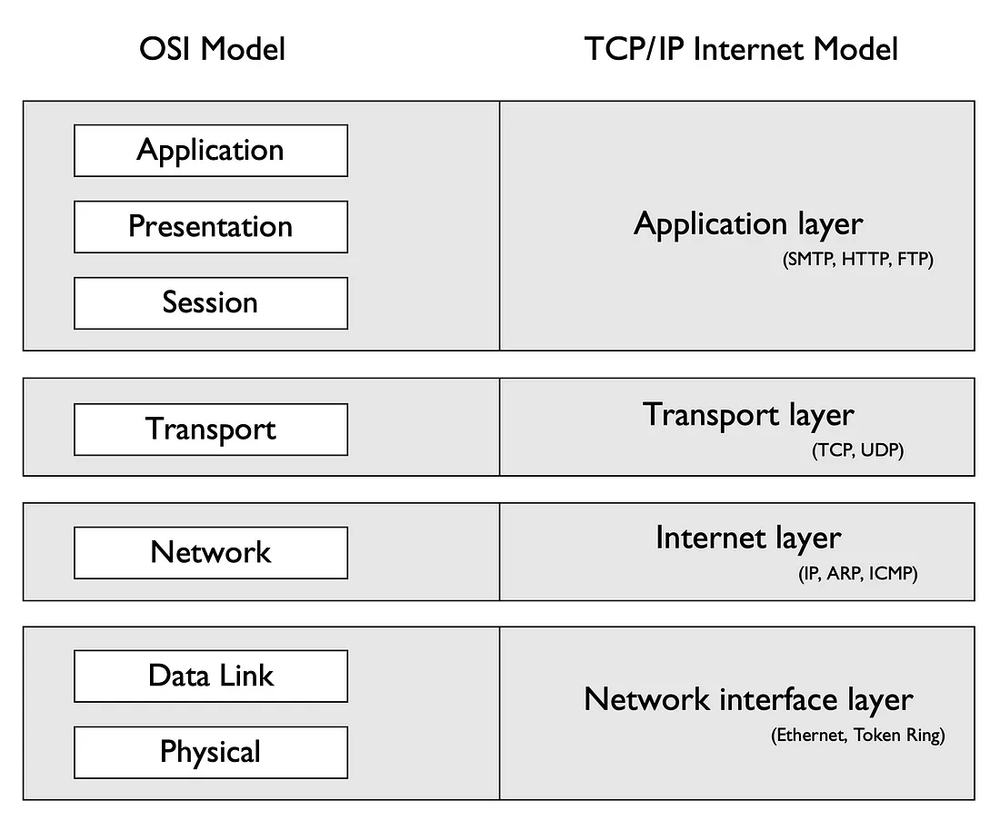

# net-practice 🌐
### Mastering Networking Fundamentals & IP Addressing

`net-practice` is a technical project from the **42 School** curriculum designed to build a rock-solid foundation in IPv4 networking. Through a series of 10 increasingly complex simulation levels, I mastered the art of subnetting, routing, and network configuration.

---

## 🚀 Project Overview
The objective is to configure small-scale networks by assigning IP addresses, setting up subnet masks, and defining routing tables to ensure all nodes can communicate according to specific rules.

### Key Skills Demonstrated:
- **IPv4 Logic**: Calculating network addresses, broadcast addresses, and host ranges.
- **Subnetting**: Utilizing CIDR notation and VLSM (Variable Length Subnet Masking) for efficient address allocation.
- **Routing**: Configuring default gateways and static routes for multi-hop communication.
- **Protocol Understanding**: Grasping the roles of DHCP, DNS, and TCP/UDP within the OSI model.

---

## 🧠 Core Technical Concepts

### 1. The Protocol Stack: OSI vs. TCP/IP
Understanding where data lives and how it moves is crucial. This project bridges the gap between layers 2 (Data Link) and 4 (Transport), with a heavy focus on Layer 3 (Network).

### 2. IP Addressing & Subnetting
I learned to move beyond Classful addressing (Class A/B/C) to **Classless Inter-Domain Routing (CIDR)**, which prevents IP waste.

| Class | Range | Default Mask | CIDR |
| :--- | :--- | :--- | :--- |
| **Class A** | 1.0.0.0 – 127.255.255.255 | 255.0.0.0 | /8 |
| **Class B** | 128.0.0.0 – 191.255.255.255 | 255.255.0.0 | /16 |
| **Class C** | 192.0.0.0 – 223.255.255.255 | 255.255.255.0 | /24 |

#### ⚡ The "Block Size" Optimization
For rapid calculations, I utilized the **Block Size method**:
1. Identify the "interesting octet" (where the mask isn't 0 or 255).
2. `Block Size = 256 - MaskValue`.
3. Networks are always multiples of this Block Size.
   *Example: `/26` means a mask of `255.255.255.192`. Block size = `64`. Networks start at `.0`, `.64`, `.128`, etc.*

---

## 🛠️ The "Net-Practice" Trainer
The project consists of 10 levels of increasing difficulty:
- **Levels 1-3**: Basic IP/Mask configuration for local peers.
- **Levels 4-6**: Introduction to Routers and Default Gateways.
- **Levels 7-10**: Complex multi-router topologies involving private/public IP translation and intricate routing tables.

### 💡 Notable Difficulty & Solution: The Default Route
A common pitfall is confusing the **Default Gateway** with the **Default Route**.
- **Default Gateway**: The actual IP of the router interface (e.g., `192.168.1.1`).
- **Default Route (0.0.0.0/0)**: The routing entry that says "send everything unknown to the gateway."

---

## 🎓 Academic & Professional Value
This project isn't just about passing tests; it's about understanding the "plumbing" of the internet.
- **DevOps/SysAdmin**: Essential for configuring VPCs in AWS/Azure or managing K8s clusters.
- **Cybersecurity**: Understanding subnets is the first step in network segmentation and firewall configuration.
- **Low-Level Dev**: Provides context for socket programming and network-aware application design.

---

## 📸 Simulation Gallery
*Screenshots from successful level completions:*

*(Example of a high-complexity multi-router setup)*

---
*Created by Smail Oujaoura as part of the 42 networking curriculum.*
