# Network Fundamentals
- Network: a group of computers connected to each other to privide services to users; networks and their components.
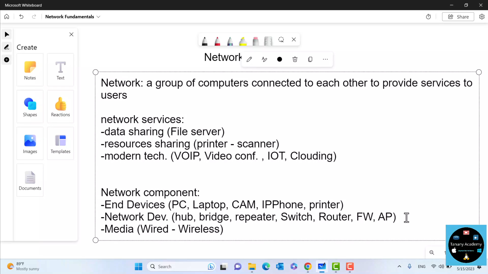
- Networks topology:
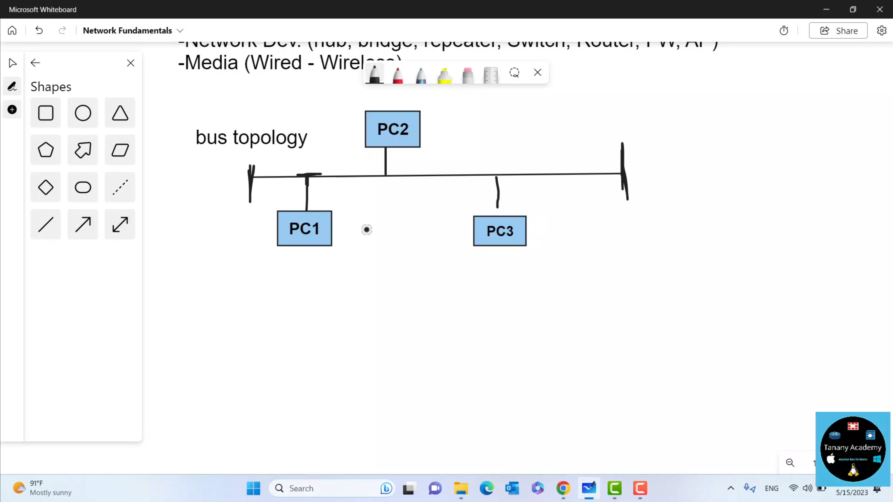
# TCP/IP and OSI models
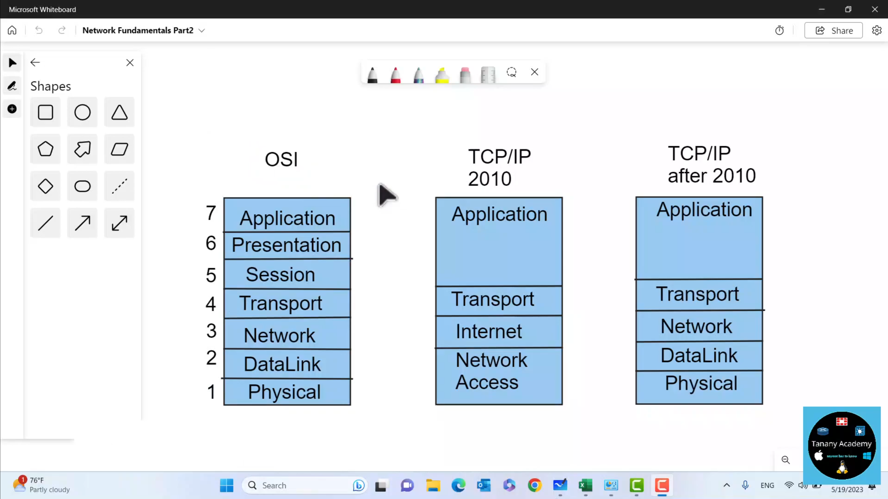
- DHCP protocol
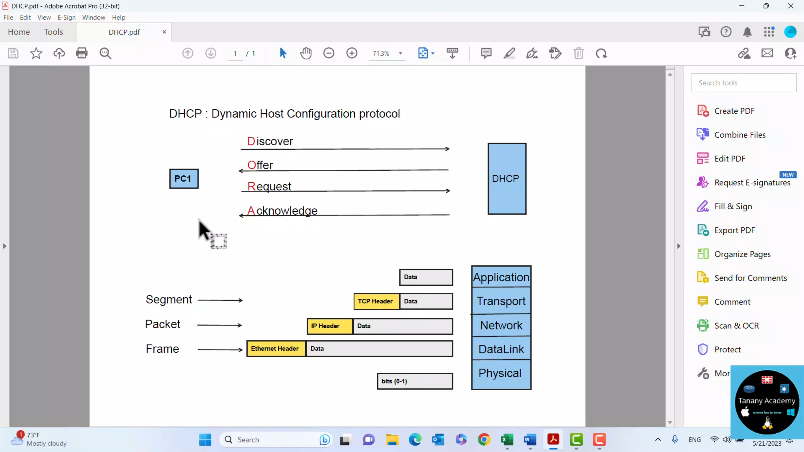

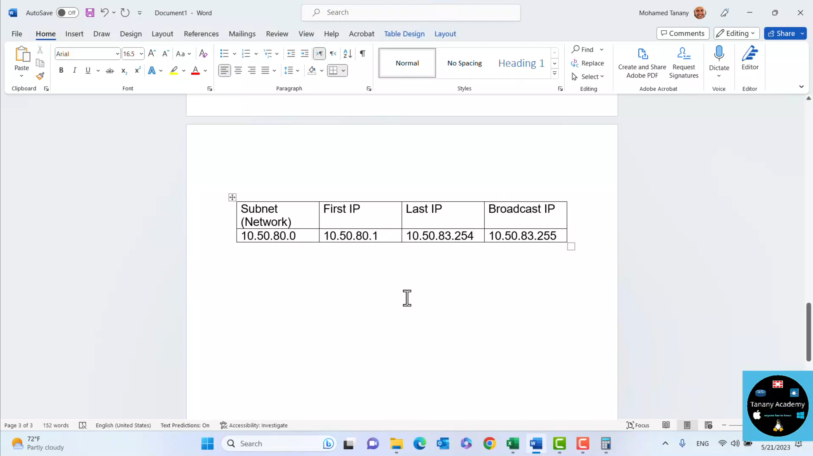
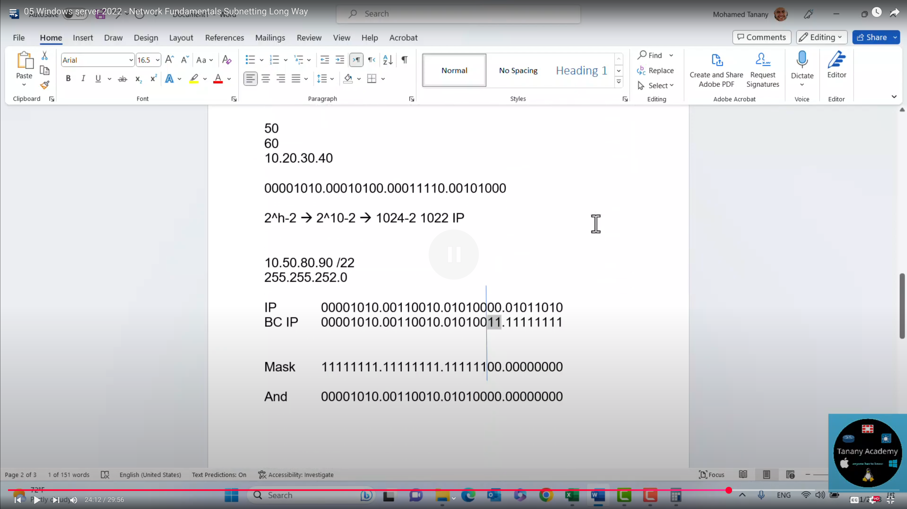
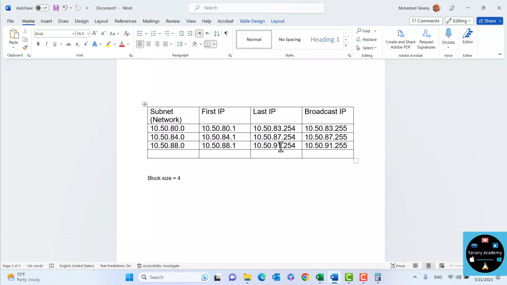

- The easiest method to find a subnet info from an ip and its subnet mask 10.50.14.2/26; you will be able to find the subnet(network), first ip, last ip, braodcast ip
- The rule says: the block size and its multiples are networks(subnetwroks) and the first starts at 0, focusing on the octet where work is on
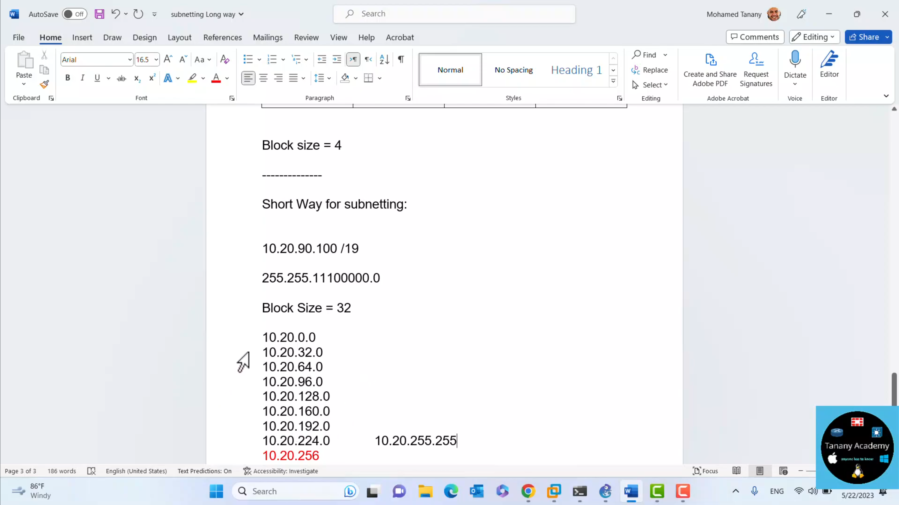
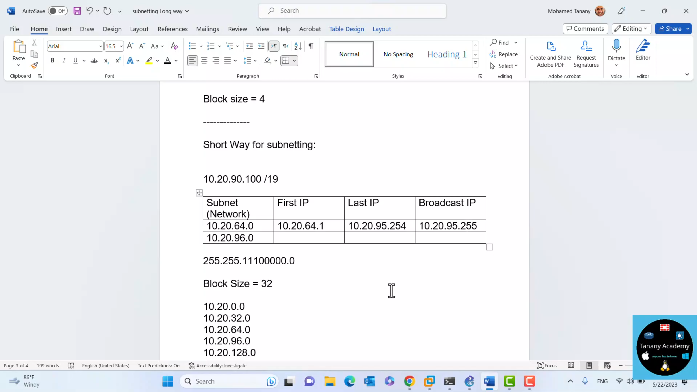
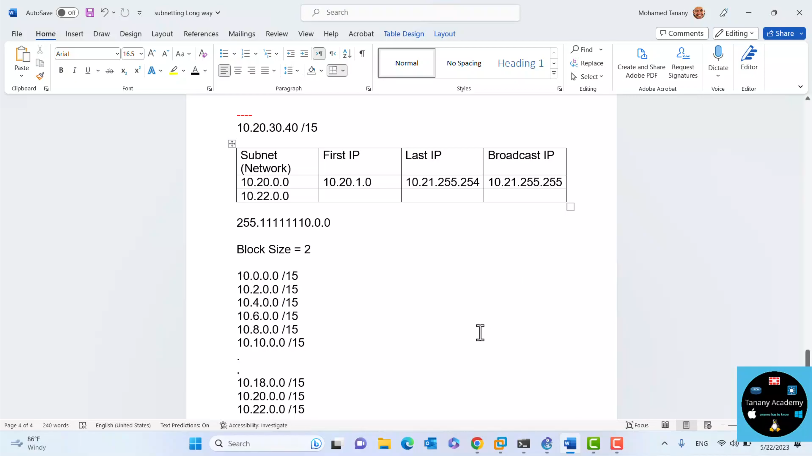
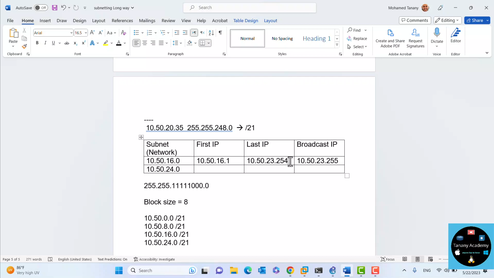
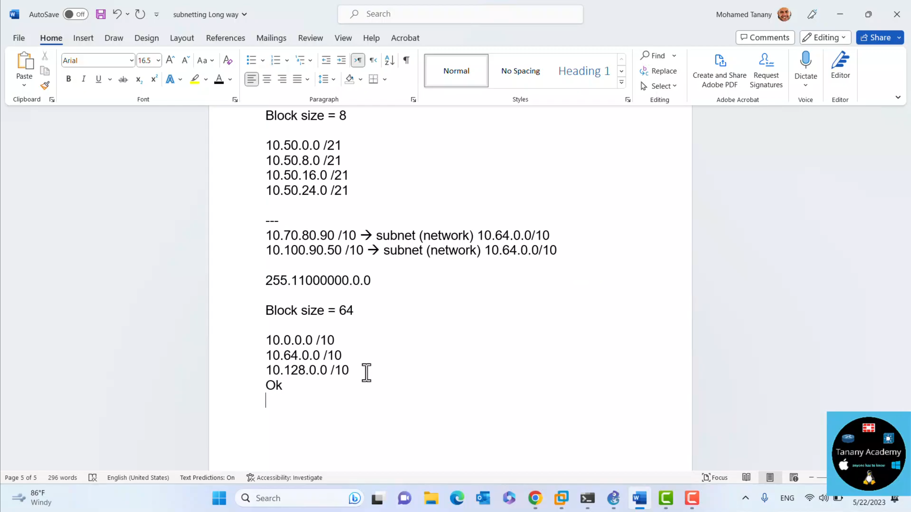
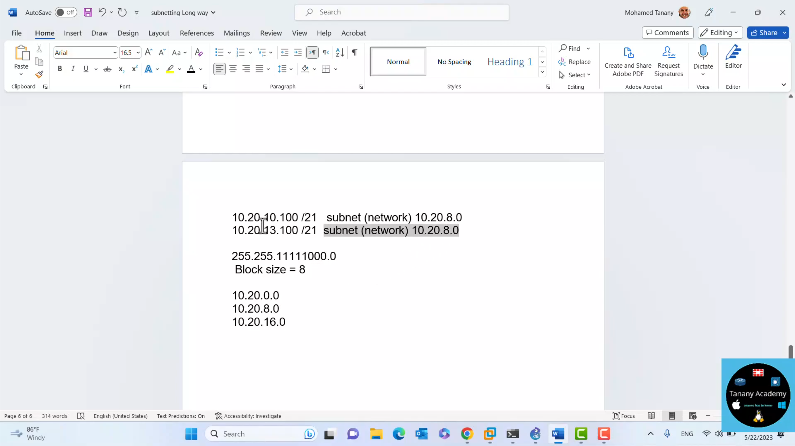
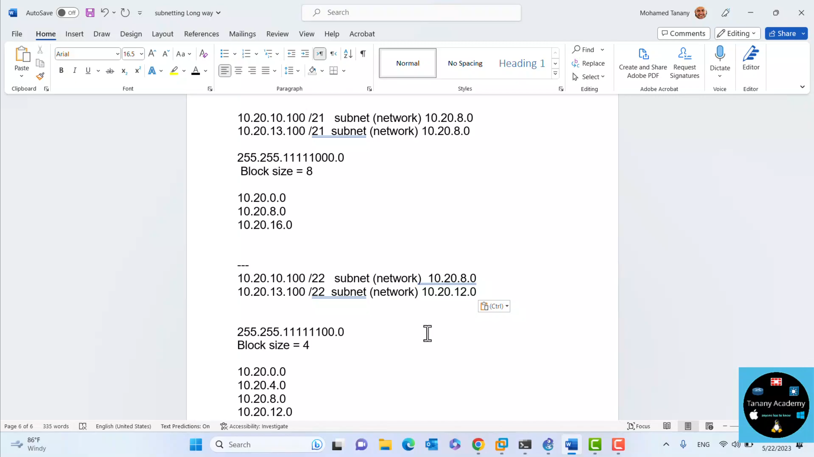
